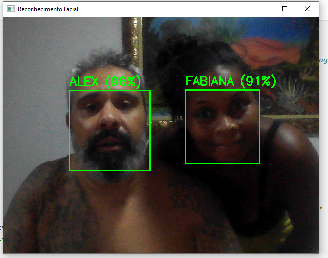

# Reconhecimento Facial em Tempo Real (Transfer Learning - MobileNetV2)

Classificador de faces personalizado capaz de identificar pessoas via webcam com alta precisão, utilizando Deep Learning e arquiteturas leves (MobileNetV2).

## ✅ Demonstração



## 🎯 Objetivo do projeto
Treinar um modelo leve com **Transfer Learning** para reconhecer rostos (ex: Alex e Fabiana) e realizar a predição em tempo real via webcam.

## ✅ Funcionalidades
- Detecção de rosto em tempo real
- Classificação por nome (classes treinadas)
- Exibição do nome + confiança (%)
- Modelo exportado em `.keras`

## 🧠 Modelo
- Arquitetura base: **MobileNetV2**
- Framework: **TensorFlow / Keras**
- Modelo: `model/modelo_rosto.keras`

## 🛠️ Instalação

```bash
pip install -r requirements.txt

▶️ Execução

Abra e execute o notebook:

notebooks/face_recognition_mobilenet.ipynb

📌 Tecnologias utilizadas

Python
TensorFlow / Keras
OpenCV
MediaPipe
NumPy
Matplotlib


---

## ✅ Commit do README (português)

**Commit message:**


✅ Commit direto na main.

---

📸 Faz esse passo e me manda print do README já mostrando a imagem.

